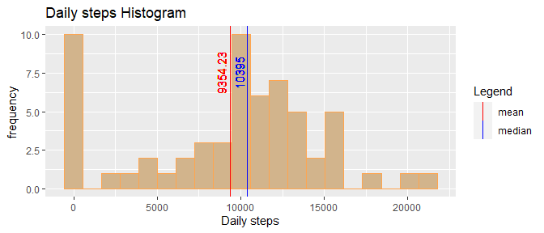
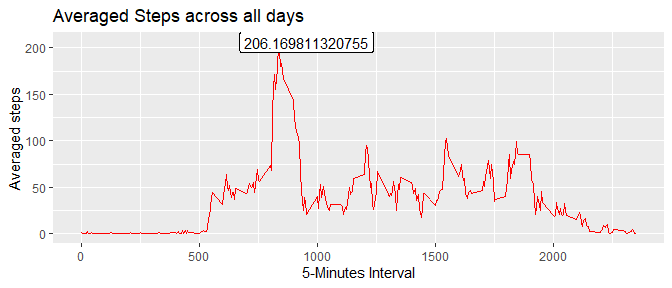
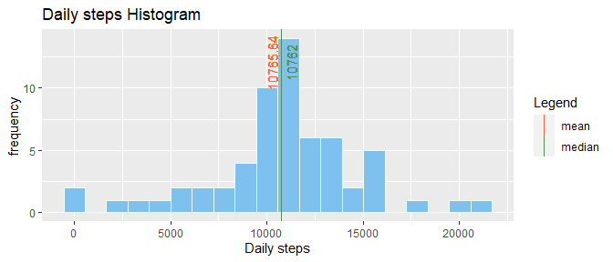
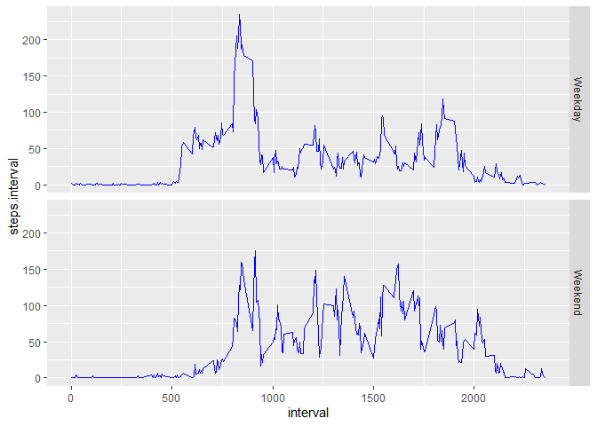

This is a small project performed at the *Reproducible Research* course by **The Johns Hopkins University** at Coursera. It corresponds to the second week of the course.

The Librarys *dplyr* and *ggplot2* are used for this project.


```r
library(dplyr)
library(ggplot2)
options(scipen = 999)
```

## Loading and preprocessing the data

First of all we'll need to unzip the file containing our data *activity.zip* and read the CSV file as a tibble, converting the Date to the right format. The resulting Data Frame is called ``steps``


```r
unzip("activity.zip")
steps <- as_tibble(read.csv("activity.csv"))
steps$date <- as.Date(steps$date)
head(steps)
```

```
## # A tibble: 6 x 3
##   steps date       interval
##   <int> <date>        <int>
## 1    NA 2012-10-01        0
## 2    NA 2012-10-01        5
## 3    NA 2012-10-01       10
## 4    NA 2012-10-01       15
## 5    NA 2012-10-01       20
## 6    NA 2012-10-01       25
```


## What is mean total number of steps taken per day?

Now we're calculating the steps per day. We need previously to process our data in order to summarize the daily steps. We call ``steps_day`` the new Data Frame that contains the steps count for every day, during 61 days.


```r
steps_day <- steps %>% group_by(date) %>% summarise(steps.day = sum(steps, na.rm=TRUE))
str(steps_day)
```

```
## tibble [61 x 2] (S3: tbl_df/tbl/data.frame)
##  $ date     : Date[1:61], format: "2012-10-01" "2012-10-02" ...
##  $ steps.day: int [1:61] 0 126 11352 12116 13294 15420 11015 0 12811 9900 ...
```

With this new Data Frame, we're able to represent an histogram based on the daily steps and calculate the median and mean value, that will be represented and labeled on the graph.


```r
meanSteps <- round(mean(steps_day$steps.day),2)
medianSteps <- median(steps_day$steps.day)
my_colors <- c("mean" = "red", "median" = "blue")
h <- ggplot(steps_day, aes(steps.day))
h + geom_histogram(color = "tan1", bins = 20, fill ="tan")+ 
        geom_vline(aes(xintercept= meanSteps, color = "mean"))+ 
        geom_vline(aes(xintercept= medianSteps, color = "median"))+
        scale_color_manual(values = my_colors)+
        labs(x= "Daily steps", 
             y="frequency", 
             color = "Legend", 
             title = "Daily steps Histogram")+
        geom_text(x=meanSteps-500, y=7.5, label = meanSteps, 
                  color= "red", angle = 90)+
        geom_text(x=medianSteps-500, y=7.5, label = medianSteps, 
                  color= "blue", angle = 90)
```

<!-- -->

On this graph are represented the mean and median values:  
- The mean value of the daily steps during this period is **9354.23**  
- The median value of the daily steps during this period is **10395**  

## What is the average daily activity pattern?

To anwser this question we need to group adding all the measured steps by the corresponding 5-minutes interval. We will use the same function of ggplot2 as before


```r
stepsIntv <- steps %>% group_by(interval) %>% summarise(steps.interval = mean(steps, na.rm=TRUE))
str(stepsIntv)
```

```
## tibble [288 x 2] (S3: tbl_df/tbl/data.frame)
##  $ interval      : int [1:288] 0 5 10 15 20 25 30 35 40 45 ...
##  $ steps.interval: num [1:288] 1.717 0.3396 0.1321 0.1509 0.0755 ...
```

With this new DataFrame called ```stepsIntv``` we are able to represent the averaged steps along the 5-minutes interval along this two months


```r
maxSteps <- stepsIntv[which.max(stepsIntv$steps.interval),]
ggplot(stepsIntv, aes(interval, steps.interval))+ 
        geom_line(color = "red")+ 
        labs(x = "5-Minutes Interval", 
             y= "Averaged steps", 
             title= "Averaged Steps across all days")+ 
        geom_label(data= maxSteps, 
                   aes(x = interval[1]+120, y = steps.interval[1], 
                       label= steps.interval[1]))
```

<!-- -->

The averaged maximum number of steps is **206.1698113** during the interval **835**

## Imputing missing values

On the original dataset there are some missing values shown as ```NA```. Let's have a look what is the total "NAs" amoung


```r
totNA <- sum(is.na(steps$steps))
perNA <- round(mean(is.na(steps$steps))*100,2)
```
The total amount of missing values is **2304** that is a **13.11**% of the total measured values.  
We will create a new data frame filling the NA values using the mean for each day using a for-loop.


```r
##Clone the main data frame, add the mean value per day
stepsImp <- full_join(steps, stepsIntv, by = "interval")
##Search NAs and replace by mean per day
for (i in 1:length(steps[[1]])) {
        if (is.na(steps[i,1])) { 
                stepsImp[i,1] <- round(stepsImp[i,4])
        }
}
```

We calculate again the total steps per day, we call this new dataframe ```steps_day2```


```r
steps_day2 <- stepsImp %>% group_by(date) %>% summarise(steps.day = sum(steps, na.rm=TRUE))
str(steps_day2)
```

```
## tibble [61 x 2] (S3: tbl_df/tbl/data.frame)
##  $ date     : Date[1:61], format: "2012-10-01" "2012-10-02" ...
##  $ steps.day: int [1:61] 10762 126 11352 12116 13294 15420 11015 10762 12811 9900 ...
```


Then we plot an histogram of the processed DataFrame without NAs.  


```r
meanSteps2 <- round(mean(steps_day2$steps.day),2)
medianSteps2 <- median(steps_day2$steps.day)
my_colors <- c("mean" = "tomato", "median" = "palegreen4")
h <- ggplot(steps_day2, aes(steps.day))
h + geom_histogram(color = "honeydew", bins = 20, fill ="skyblue2")+ 
        geom_vline(aes(xintercept= meanSteps2, color = "mean"))+ 
        geom_vline(aes(xintercept= medianSteps2, color = "median"))+
        scale_color_manual(values = my_colors)+
        labs(x= "Daily steps", 
             y="frequency", 
             color = "Legend", 
             title = "Daily steps Histogram")+
        geom_text(x=meanSteps2-500, y=12, label = meanSteps2, 
                  color= "tomato", angle = 90)+
        geom_text(x=medianSteps2+500, y=12, label = medianSteps2, 
                  color= "palegreen4", angle = 90)
```

<!-- -->

So we can compare how the mean and median have changed after the imputation of values  

value | before imputation | after imputation
------|-------------------|-----------------
mean  | 9354.23     | 10766
median| 10395   | 10762


## Are there differences in activity patterns between weekdays and weekends?

A new variable is needed to identify if the day is Weekend or not.   


```r
steps$weekday <- weekdays(steps$date)
steps$typeDay <- if_else(steps$weekday %in% c("sábado", "domingo"), "Weekend", "Weekday")
stepsIntvDay <- steps %>% group_by(interval, typeDay) %>% summarise(steps.interval = mean(steps, na.rm = T))
```
Then the function facets of ggplo2 is used to represent the paterns during the wekend


```r
ggplot(stepsIntvDay, aes(interval, steps.interval))+geom_line(color = "blue")+facet_grid(rows = vars(typeDay))
```

<!-- -->
